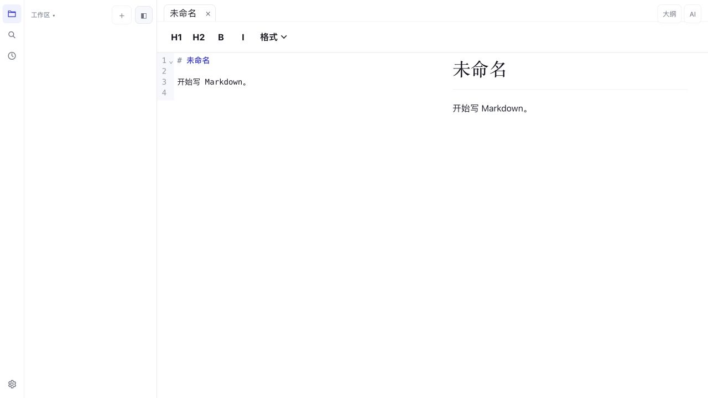

# LMD

LMD is a local-first Markdown note app for macOS, built with Tauri, React, CodeMirror, and Rust. It focuses on fast note taking, source/preview writing, workspace knowledge organization, and AI-assisted drafting without moving your Markdown files into a proprietary database.



[MIT licensed](LICENSE).

## Highlights

- Native macOS desktop app powered by Tauri
- Local Markdown files, workspace folders, recent files, tabs, and closable documents
- Source, reading, and split views controlled from the macOS `View` menu
- Native `Insert`, `Format`, and `View` menus for Markdown operations and layout controls
- On-demand document search via `Edit -> 在文档中查找` or `Cmd+F`
- Markdown preview with Front Matter hiding, KaTeX math, Mermaid, PlantUML blocks, callouts, footnotes, `[TOC]`, task lists, tables, and highlighted code
- Knowledge workspace protocol with `notes/`, `sources/`, `wiki/`, and `wiki/inbox/`
- Wiki links, backlinks, block IDs, block references, tags, linting, and source context
- AI assistant chat with DeepSeek, MiniMax, Kimi, 智谱 GLM, Ollama, LM Studio, or an external command
- Streaming AI responses in the chat UI and save-to-wiki draft workflows
- HTML, PDF, and DOCX export
- Git status, diff, and commit support for workspace folders
- Rust backend tests and Playwright browser E2E tests

## Features

### Editing

- CodeMirror 6 Markdown source editor
- Document tabs with close buttons and right-click menu actions
- Native Finder drag and drop: open multiple Markdown files as tabs or open a folder as a workspace
- `Cmd+O` opens Markdown and `Cmd+Shift+O` opens a workspace
- Tab right-click actions for rename and close
- Unsaved tabs are marked with `*`
- `Cmd+F` opens a temporary find bar instead of occupying permanent toolbar space
- Long Markdown documents scroll correctly in source and reading views
- Large-file read-only paging for Markdown files over 5 MB
- External file metadata polling for missing or modified files

### Markdown Rendering

- YAML Front Matter is hidden in preview and export output
- GFM-style tables, task lists, strikethrough, images, links, and autolinks
- `==highlight==` text marks
- Footnotes with return links
- Obsidian-style callouts such as `> [!NOTE]`
- `[TOC]` automatic document table of contents
- KaTeX block and inline math
- Mermaid diagrams
- PlantUML / `puml` blocks with dedicated rendering style
- Syntax-highlighted code blocks with copy buttons in preview
- Block anchors such as `^block-id`
- Wiki-style links such as `[[note]]` and `[[note#^block-id]]`

### macOS Menus

LMD moves editing controls out of the document canvas and into native menus.

- `Insert`
  - links, annotations, code blocks, math blocks, footnotes
  - tables, formatted tables, rows, columns, CSV tables
  - unordered, ordered, and task lists
  - block IDs and block references
  - attachments and folding actions
- `Format`
  - headings H1-H6
  - bold, italic, highlight, strikethrough
  - inline math, comments, code blocks
- `View`
  - source mode, reading mode, vertical split, horizontal split
  - left/right sidebar visibility
  - feature area visibility
  - navigation, zoom, reload, and developer tools
- `Edit`
  - `在文档中查找` with `Cmd+F`

The checked state in the `View` menu is synchronized from the actual app state.

### Workspace and Knowledge

Open a folder as a workspace, then use `Knowledge -> 初始化知识库` from the macOS menu or the command palette. LMD creates:

```text
notes/
sources/
wiki/
wiki/inbox/
.lmd/knowledge/
.lmd/knowledge/lmd.db
AGENTS.md
wiki/index.md
wiki/log.md
```

Workspace capabilities include:

- folder scanning for Markdown files
- recently opened workspaces in the Recent view
- recent files and removable recent entries
- SQLite-backed knowledge indexing in `.lmd/knowledge/lmd.db`
- workspace search with `path:`, `#tag`, and `block:^id` queries through the local index
- backlinks, outgoing links, unresolved links, block references, aliases, tags, and front matter
- knowledge lint reports
- tag rename across front matter and body `#tag` references
- document history snapshots in `.lmd/history`
- Git status, diff, and commit actions

AI drafts saved from the assistant are written to:

```text
<workspace>/wiki/inbox/<draft-title>.md
```

The app also refreshes the workspace and updates knowledge index/log files when relevant.

### AI Assistant

LMD supports multiple OpenAI-compatible and local assistant providers:

- DeepSeek
- MiniMax
- Kimi / Moonshot
- 智谱 GLM / Z.ai
- Ollama
- LM Studio
- external command

Assistant features:

- chat with loading and streaming UI feedback
- current-note and workspace context loading
- quick actions such as summarize, polish, extract todos, generate title, generate outline, and continue writing
- save AI draft to `wiki/inbox/`
- save AI chat as a wiki draft
- macOS Keychain API key storage, with localStorage fallback for browser preview

Environment variable fallbacks:

- `DEEPSEEK_API_KEY`
- `MINIMAX_API_KEY`
- `MOONSHOT_API_KEY`
- `ZAI_API_KEY`
- `OLLAMA_BASE_URL`
- `LM_STUDIO_BASE_URL`

The external command provider is hidden under advanced settings. It runs a local executable and sends one JSON object to stdin:

```json
{
  "provider": "external_command",
  "model": "command-json-v1",
  "task": "summarize",
  "prompt": "Optional user instruction",
  "currentContent": "# Current note",
  "context": {
    "currentPath": "/absolute/path/to/current.md",
    "currentRelativePath": "notes/current.md",
    "items": []
  }
}
```

The command must write an assistant draft JSON object to stdout:

```json
{
  "title": "Topic summary",
  "content": "# Topic summary\n\n## Summary\n\nDraft text."
}
```

## Export

LMD can export the current Markdown document as:

- HTML
- PDF
- DOCX

DOCX export depends on a local `pandoc` installation.

## Tech Stack

- Frontend: React, TypeScript, Vite
- Editor: CodeMirror 6
- Desktop runtime: Tauri v2
- Backend: Rust
- Markdown rendering: `markdown-it`, `markdown-it-task-lists`, `markdown-it-texmath`, KaTeX, Mermaid, highlight.js
- UI testing: Playwright

## Project Layout

```text
src/           React UI, preview renderer, hooks, components
src-tauri/     Rust backend, file IO, export, workspace, assistant, git
tests/e2e/     Playwright browser-based UI tests
docs/          QA notes, screenshots, and design notes
```

## Quick Start

Requirements:

- Node.js
- npm
- Rust toolchain
- Tauri prerequisites for your platform
- Optional: `pandoc` for DOCX export

Install dependencies:

```bash
npm install
```

Run the macOS desktop app in development:

```bash
npm run tauri:dev
```

Run only the frontend browser preview:

```bash
npm run dev
```

The browser preview mocks native Tauri calls in tests and cannot perform real local file operations by itself.

## Test and Build

Frontend build:

```bash
npm run build
```

Rust tests:

```bash
cd src-tauri
cargo test
```

Browser E2E:

```bash
npm run test:e2e
```

Desktop bundle:

```bash
npm run tauri build
```

Current macOS release outputs:

- `src-tauri/target/release/bundle/macos/LMD.app`
- `src-tauri/target/release/bundle/dmg/LMD_0.1.0_aarch64.dmg`

## Testing Strategy

LMD uses three layers of verification:

1. Rust tests
   - real file save/open/export flows
   - metadata changes
   - workspace scanning and SQLite-backed search
   - knowledge workspace operations, alias links, and index creation
   - assistant provider validation
   - Git parsing and workspace status
2. Playwright browser tests
   - editing, preview, split view, and source scrolling
   - tab open/close/rename behavior
   - search, settings, workspace, knowledge, assistant, and export flows
3. Tauri build verification
   - ensures `.app` and `.dmg` bundles still build locally

More detail:

- [QA checklist](docs/qa-release-checklist.md)
- [Tauri WebView automation notes](docs/tauri-webview-automation-notes.md)

## Platform Notes

- LMD is currently developed and verified primarily on macOS.
- Native Tauri WebDriver automation is not available on macOS because Tauri desktop WebDriver support does not currently cover WKWebView.
- The repository therefore uses Rust real file-flow tests, Playwright browser tests with mocked Tauri commands, and real Tauri bundle verification.

## Known Limits

- Preview and HTML export intentionally disable raw HTML input.
- PDF export is lightweight and not a full layout engine.
- DOCX export requires `pandoc`.
- Release builds are not signed or notarized yet.
- Native Tauri WebDriver coverage would need Linux or Windows CI.
- The UI is evolving quickly; screenshots should be refreshed when menu, workspace, or assistant layouts change.

## Status

LMD is usable, testable, and buildable, but still early.

High-priority remaining work:

- code signing and notarization
- release artifact refresh for public launch
- optional native Tauri WebDriver coverage on supported CI platforms
- further export layout improvements
- deeper knowledge graph and semantic search features

## Contributing

- [Contributing guide](CONTRIBUTING.md)
- [Roadmap](ROADMAP.md)
- [Security policy](SECURITY.md)
- [Code of conduct](CODE_OF_CONDUCT.md)
- [Changelog](CHANGELOG.md)
