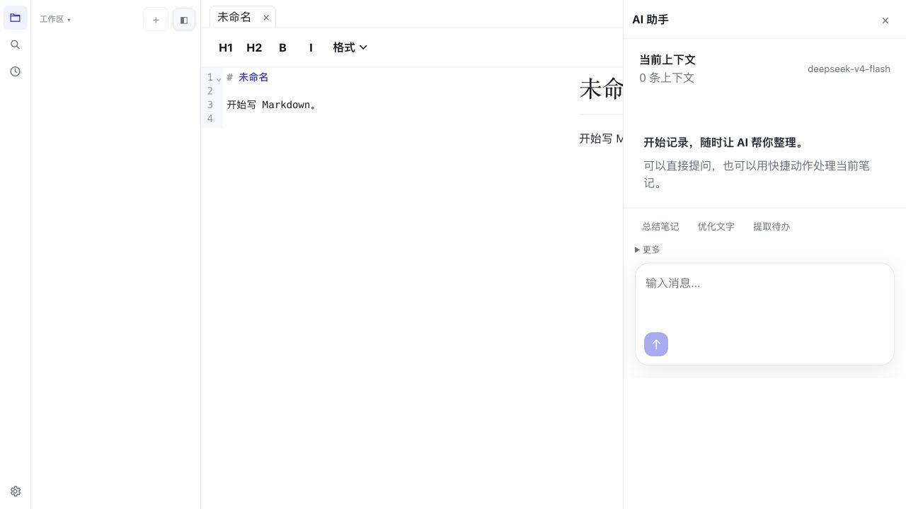
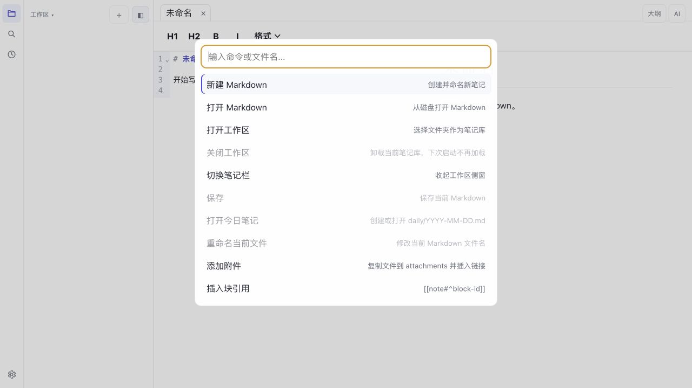

# LMD

[English](README.md) | [简体中文](README.zh-CN.md)

**本地优先的 Markdown 笔记、关联知识与 AI Wiki 草稿工具。**

LMD 是一款原生 macOS 应用，用于编写 Markdown、把本地文件夹组织成知识工作区，并利用 AI 将笔记及其关联上下文整理为可审阅的 Wiki 草稿。所有源文件仍然是你所控制文件夹中的普通 Markdown，不需要迁移进专有笔记数据库。

[下载适用于 macOS ARM64 的 LMD 0.1.1](https://github.com/TaylorChen/lmd/releases/tag/0.1.1) · [路线图](ROADMAP.md) · [更新日志](CHANGELOG.md)

> **早期版本提示：** 当前 macOS 安装包尚未签名或公证。如果 Gatekeeper 阻止首次启动，请打开 DMG、将 LMD 拖入“应用程序”，然后在 Finder 中按住 Control 点击 LMD 并选择“打开”。

## 界面截图

### 安静的 Markdown 工作区


### 需要时才出现的 AI 助手



### 用一个命令入口发现文件、知识、AI 与导出能力



## 为什么选择 LMD

- **笔记始终属于你。** 文件仍然是磁盘上的普通 `.md` 文档。
- **不改变格式也能连接知识。** 支持 Wiki 链接、反向链接、标签、Front Matter、别名、块 ID 和块引用。
- **让 AI 基于本地工作区。** 使用当前笔记和索引到的关联上下文，并将结果保存为 `wiki/inbox/` 下的 Markdown 草稿。
- **自由选择本地或云端模型。** 可使用 Ollama、LM Studio、本地外部命令或兼容的在线模型服务。
- **保持专注。** 工作区侧栏、大纲、知识检查器和 AI 抽屉均按需出现，不会永久压缩编辑区。

## 核心工作流

### 编写 Markdown

打开文件、将一个或多个 Markdown 文件拖入 LMD，或者创建新笔记。使用 CodeMirror 6 在源码、预览或分屏模式中写作；预览支持表格、任务列表、数学公式、图表、Callout、脚注、代码高亮和文档目录。

### 打开本地工作区

将文件夹拖入 LMD，或按 `Cmd+Shift+O`。该文件夹会成为工作区，同时保留现有和未保存标签页。文件、搜索、最近项目、历史快照和 Git 操作都与这个本地文件夹绑定。

### 建立关联知识

通过原生 **知识** 菜单或命令面板初始化工作区。LMD 会创建透明、可直接查看的目录协议：

```text
notes/
sources/
wiki/
wiki/inbox/
.lmd/knowledge/lmd.db
AGENTS.md
wiki/index.md
wiki/log.md
```

本地 SQLite 索引用于工作区搜索、Wiki 链接解析、反向链接、失效链接检查、标签、别名、块引用、知识检查和关联上下文加载。

### 使用 AI 起草，结果仍保存在本地

打开按需 AI 抽屉，可以总结、优化、提取待办、生成标题或大纲、续写，或者自由提问。生成内容可以插入当前笔记、替换选区，或保存为：

```text
<workspace>/wiki/inbox/<draft-title>.md
```

## 功能

### 编辑与 Markdown

- 标签页、未保存状态、重命名与关闭操作
- 原生文件和文件夹拖拽
- `Cmd+O` 打开 Markdown，`Cmd+Shift+O` 打开工作区
- 源码、预览、左右分屏和上下分屏
- 临时出现的 `Cmd+F` 文档搜索
- 超过 5 MB 文件的只读分页
- 外部修改或删除检测
- 预览和导出时隐藏 YAML Front Matter
- 表格、任务列表、删除线、`==高亮==`、脚注、`[TOC]` 和 Obsidian 风格 Callout
- KaTeX 数学公式、Mermaid、PlantUML、代码高亮与复制按钮

### 知识与工作区

- 基于 SQLite 的完整工作区索引
- 支持 `path:`、`#tag` 和 `block:^id` 查询
- Wiki 链接、反向链接、失效链接、别名与块引用
- 可编辑 Front Matter 和工作区标签级联重命名
- 知识检查报告与索引重建
- 最近文件与最近工作区
- 每日笔记、附件、历史快照以及 Git 状态、diff 和提交

### AI 助手

- DeepSeek、MiniMax、Kimi/Moonshot、智谱 GLM/Z.ai、Ollama 和 LM Studio
- 高级本地外部命令提供方，通过 stdin/stdout 交换 JSON
- 原生应用中的流式回复
- 当前笔记与已索引工作区上下文
- 总结、优化、提取待办、标题、大纲、续写和自由对话
- 插入、替换选区、保存 Wiki 草稿与归档对话
- 原生应用使用 macOS 钥匙串保存 API Key

### 导出

- HTML
- 轻量 PDF
- 通过本地 `pandoc` 导出 DOCX

## 安装

LMD 目前主要在 macOS 上开发和验证。

1. 打开 [LMD 0.1.1 Release](https://github.com/TaylorChen/lmd/releases/tag/0.1.1)。
2. Apple 芯片 Mac 下载 `LMD_0.1.1_aarch64.dmg`。
3. 将 LMD 拖入“应用程序”。
4. 由于当前早期版本尚未签名或公证，如果 macOS 阻止启动，请在 Finder 中按住 Control 点击 LMD，并选择“打开”。

目前尚未提供 Windows、Linux、Intel macOS、代码签名、公证和自动更新。

## 第一次使用

- 拖入 Markdown 文件，将它们作为标签页打开。
- 拖入文件夹，将它作为工作区。
- 使用 `Cmd+K` 打开命令面板。
- 从 **知识 → 初始化知识库** 或命令面板启用知识功能。
- 在设置中配置 AI；如需完全本地推理，可以使用 Ollama 或 LM Studio。

## 本地开发

### 环境要求

- Node.js 与 npm
- Rust 工具链，并确保 Cargo 位于 `PATH`
- macOS 上所需的 Tauri v2 前置环境
- 可选：用于 DOCX 导出的 `pandoc`

```bash
npm install
npm run tauri:dev
```

仅运行浏览器前端预览：

```bash
npm run dev
```

浏览器预览无法执行真实的本地文件操作。Playwright 测试会安装模拟的 Tauri 命令来覆盖 UI 工作流。

## 验证与打包

```bash
npm run build
npm run test:e2e
cargo test --manifest-path src-tauri/Cargo.toml
npm run tauri build
```

本地 macOS 构建产物位于：

```text
src-tauri/target/release/bundle/macos/LMD.app
src-tauri/target/release/bundle/dmg/
```

DMG 文件名会反映应用版本和本机构建架构。

## 项目结构

```text
src/           React 界面、编辑器 Hooks、Markdown 渲染与组件
src-tauri/     Rust 后端：文件、工作区索引、AI、导出与 Git
tests/e2e/     Playwright 浏览器 UI 与工作流测试
docs/          QA 说明、截图与设计文档
```

## 当前限制与方向

- 预览和 HTML 导出会主动禁用原始 HTML。
- PDF 导出是轻量实现，尚不能覆盖所有复杂排版。
- DOCX 导出依赖本地 `pandoc`。
- Release 安装包尚未签名或公证。
- macOS 原生 WebView 暂无可用的自动化支持，因此项目结合 Rust 文件流程测试、模拟 Tauri 的 Playwright UI 测试和真实本地打包验证。
- 更深入的语义检索、来源透明度、知识审核工作流和代码签名仍属于路线图，而不是当前功能。

更多信息请查看 [路线图](ROADMAP.md) 和 [QA 检查清单](docs/qa-release-checklist.md)。

## 参与贡献

欢迎提交贡献和范围明确的缺陷报告。

- [贡献指南](CONTRIBUTING.md)
- [安全策略](SECURITY.md)
- [行为准则](CODE_OF_CONDUCT.md)
- [更新日志](CHANGELOG.md)
- [MIT 许可证](LICENSE)
